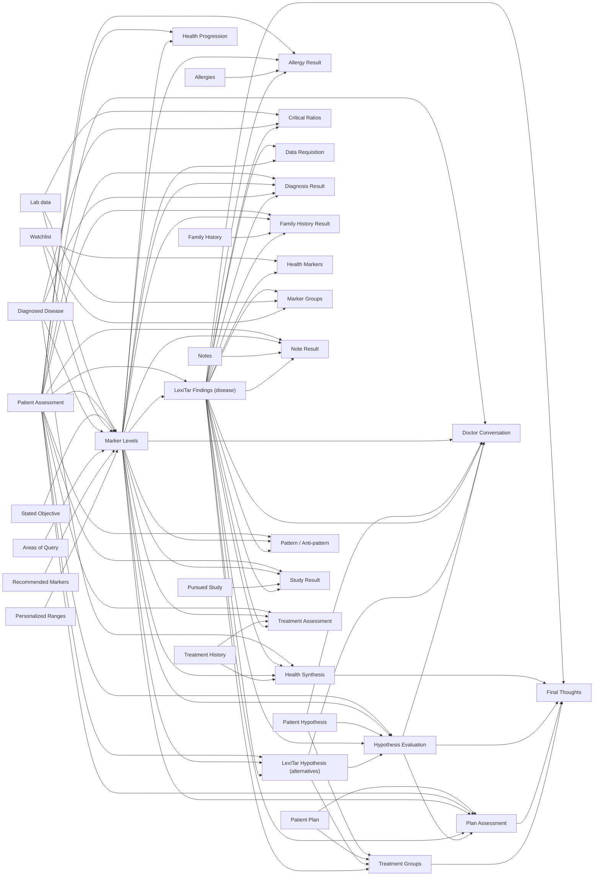

# The Finding DAG

The Finding is not a single opaque blob: every section declares, in `src/lib/finding-dag.ts`,
which inputs and which other sections it depends on. That manifest is the single source of
truth for two things a monolithic report can't otherwise offer — per-section staleness (editing
one input invalidates only its dependents, not the whole report) and this diagram, which is
generated from the manifest by `npm run dag:mermaid` rather than hand-drawn. A unit test
(`tests/unit/finding-dag.test.ts`) pins the block below against the generator's output, so the
picture can never drift from the code. Do not hand-edit between the markers.

<!-- DAG:START -->

<!-- DAG:END -->
